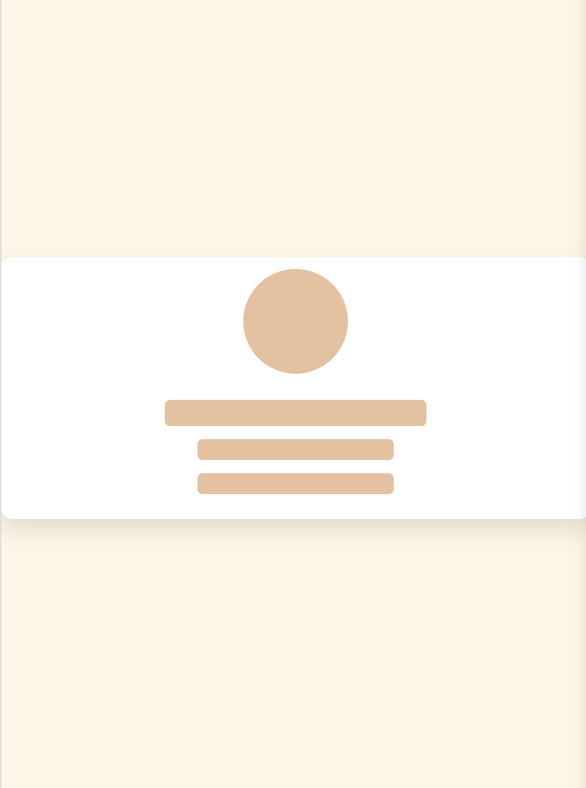
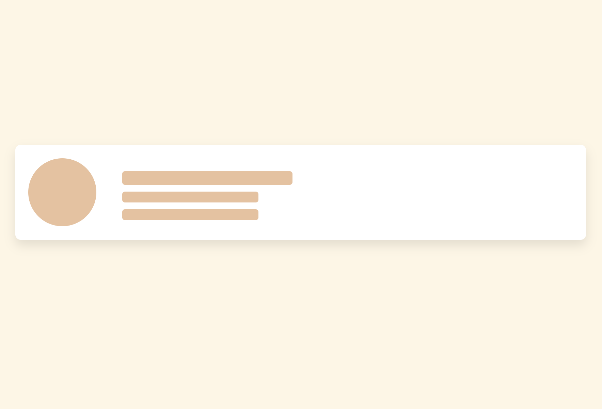
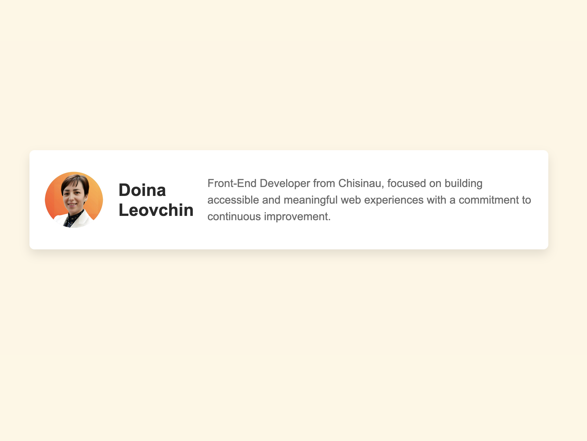

# User Profile Skeleton

## Table of Contents

- [User Profile Skeleton](#user-profile-skeleton)
  - [Table of Contents](#table-of-contents)
  - [Overview](#overview)
    - [The challenge](#the-challenge)
    - [Screenshots](#screenshots)
    - [Links](#links)
  - [My process](#my-process)
    - [Built with](#built-with)
    - [What I learned](#what-i-learned)
    - [Continued Development](#continued-development)
    - [Useful Resources](#useful-resources)
  - [Installation Instructions](#installation-instructions)
  - [Dependencies](#dependencies)
  - [Usage Instructions](#usage-instructions)
  - [Project Structure](#project-structure)
    - [Key Files](#key-files)
  - [Author](#author)

## Overview

### The challenge

The goal of this project was to create a user profile skeleton screen that displays a loading state before showing the actual user profile information. This approach enhances the user experience by indicating that data is being loaded.

### Screenshots

| Device      | State   | Screenshot                                                |
| ----------- | ------- | --------------------------------------------------------- |
| **Mobile**  | Loading |    |
|             | Final   |          |
| **Desktop** | Loading |  |
|             | Final   |        |

### Links

- [Live Demo](https://doileo.github.io/user-profile-skeleton/)
- [GitHub Repository](https://github.com/Doileo/user-profile-skeleton)

## My process

### Built with

- HTML5
- CSS3
- JavaScript

### What I learned

- Implementing skeleton screens to enhance the user experience during data loading.
- Using CSS animations for a smooth loading effect.
- Handling dynamic content updates with JavaScript.

### Continued Development

Future improvements may include:

- Integrating real API calls to fetch user data.
- Enhancing the design with additional animations and transitions.
- Adding more responsive design features for various screen sizes.

### Useful Resources

- [CSS Animations](https://developer.mozilla.org/en-US/docs/Web/CSS/animation)
- [Responsive Web Design Basics](https://web.dev/responsive-web-design-basics/)
- [JavaScript DOM Manipulation](https://developer.mozilla.org/en-US/docs/Web/API/Document_Object_Model/Introduction)

## Installation Instructions

1. Clone the repository:

   ```bash
   git clone https://github.com/yourusername/user-profile-skeleton.git

   ```

2. Navigate to the project directory:
   ```bash
   cd user-profile-skeleton
   ```
3. Open `index.html` in your preferred web browser to view the project.

## Dependencies

No external dependencies are required for this project. All styles and functionality are handled through native HTML, CSS, and JavaScript.

## Usage Instructions

- The initial skeleton screen will be displayed.
- After 5 seconds, the profile content will appear with user details.
- Customize the `script.js` file to change the simulated user data.

## Project Structure

- `index.html`
- `style.css`
- `script.js`
- `images/`
- `README.md`

### Key Files

- `index.html`: The main HTML file containing the structure of the profile and skeleton screen.
- `styles.css`: The stylesheet defining the styles for the skeleton screen and profile content.
- `script.js`: The JavaScript file simulating data fetch and updating the DOM.
- `images/`: Folder containing screenshots of the project in both mobile and desktop views (loading and final states).

## Author

- LinkedIn - [@Doina](https://www.linkedin.com/in/doinaleovchindeveloper/)
- GitHub - [@Doileo](https://github.com/Doileo)
